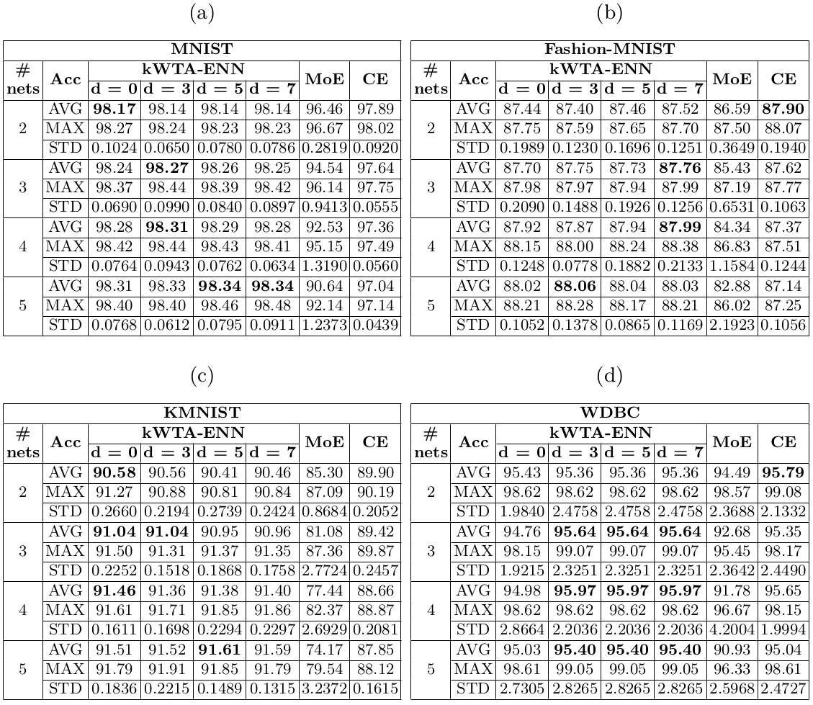
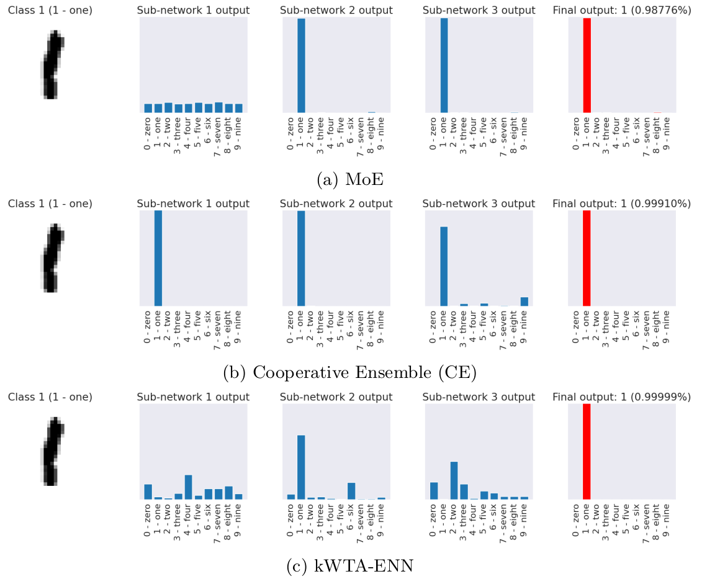
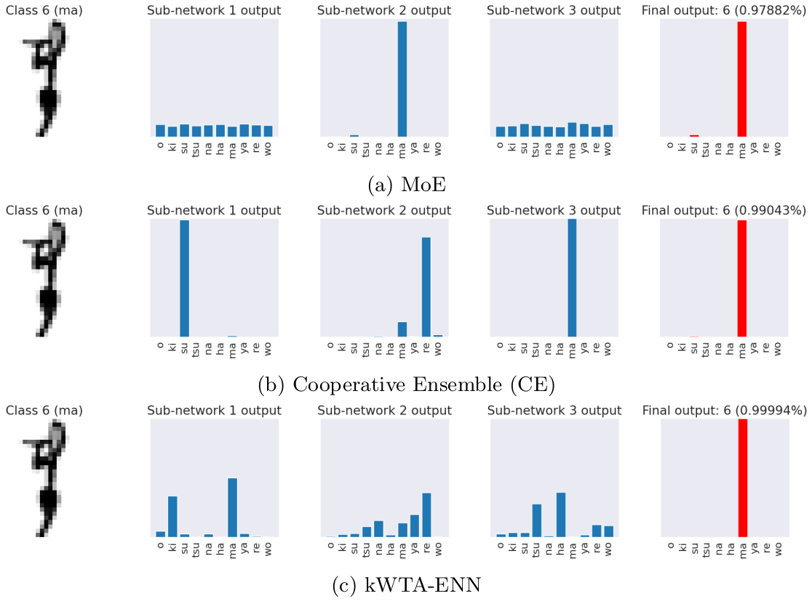
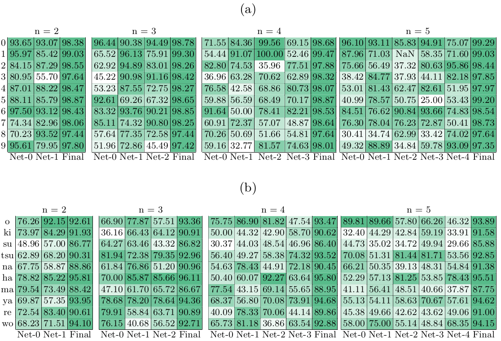

# k-Winners-Take-All Ensemble Neural Network

## Abstract

Ensembling is one approach that improves the performance of a neural network by
combining a group of them. It combines a number of independent neural networks
usually by averaging or summing up their individual outputs. In this work, we
modify the ensemble of independent neural networks by training the sub-networks
concurrently instead of independently. This concurrent training of sub-networks
lead them to cooperate with each other, and we refer to them as "cooperative
ensemble" of networks. Meanwhile, the mixture-of-experts approach improves the
performance of a neural network by dividing up a given dataset to a group of
neural networks; and with a gating network assigning a specialization to each
of its sub-networks called "experts". Instead of the aforementioned ways for
combining a group of neural networks, we propose to use a k-Winners-Take-All
(kWTA) activation function to act as the combination method for the outputs of
each sub-network in the ensemble, which we call "kWTA ensemble neural
networks" (kWTA-ENN). With kWTA, the losing neurons of the sub-networks are
inhibited while the winning neurons are retained, which results to sub-networks
having some form of specialization but also sharing knowledge with one another.
We compare our approach with the cooperative ensemble of networks and
mixture-of-experts, where we used a feed-forward network with one hidden layer
having 100 neurons as the sub-network architecture. Our approach yielded a
better performance than our baseline models, reaching the following test
accuracies on benchmark datasets: 98.34% on MNIST, 88.06% on Fashion-MNIST,
91.61% on KMNIST, and 95.97% on WDBC.

## Usage

It is recommended to create a virtual environment for this repository.

```buildoutcfg
$ pyenv virtualenv 3.8.8 kwta-ensemble
$ pyenv local kwta-ensemble
```

Then, either `pip` or `poetry` could be used to set up its dependencies.

```
$ pip install -r requirements
$ # or
$ poetry install
```

## Results

To demonstrate the improvement in model performance using our approach, we used
four benchmark datasets for evaluation: MNIST, Fashion-MNIST, KMNIST,
and Wisconsin Diagnostic Breast Cancer (WDBC). We ran each model ten
times, and we report the average, best, and standard deviation of test
accuracies for each of our model.

**Hardware and Software Configuration** We used a laptop computer withan Intel
Core i5-6300HQ CPU with Nvidia GTX 960M GPU for training all our models. Then we
used the following arbitrarily chosen 10 random seeds for reproducibility: 42,
1234, 73, 1024, 86400, 31415, 2718, 30, 22, and 17.


Figure 1. Classification results on the benchmark datasets (bold values
represent the best results) in terms of average, best, and standard deviation
of test accuracies (in %). Our k-WTA ensemble network achieves better test
accuracies than our baseline models.


Figure 2. Predictions of each sub-network on a sample MNIST data and their respective
final outputs. In 2a, we can infer that MoE
sub-networks 2 and 3 are specializing on class 1. In
2b, all CE sub-networks have high
probability outputs for class 1. In 2c,
kWTA-ENN sub-networks 1 and 2 helped each other but with the kWTA function, the
neurons for other classes were most likely inhibited at inference, thus its
higher probability output than MoE and CE.


Figure 3. Predictions of each sub-network on a sample KMNIST data and their
respective final outputs. In 3a, we can
infer that MoE sub-network 2 is specializing on class 6 ("ma"). In
3b, CE sub-network 3 was assisted by
sub-network 2. In 3c, kWTA-ENN sub-networks
1 and 2 helped each other but with the kWTA function, the neurons for other
classes were most likely inhibited at inference, thus its higher probability
output than MoE and CE.


Figure 4. Classification results of each kWTA-ENN sub-network and kWTA-ENN
itself on MNIST (4a) and KMNIST
(4b) datasets. The tables show the test accuracy of
each sub-network on each dataset class, indicating a degree of specialization
among the sub-networks. Furthermore, the final model accuracy on each class
show that combining the sub-network outputs have stronger predictive
capability. These divisions were in no way pre-determined but show how
cooperation by specialization can be done through competitive ensemble.
